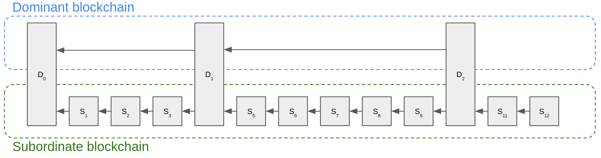
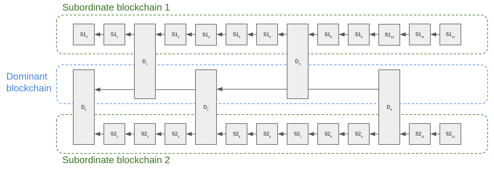
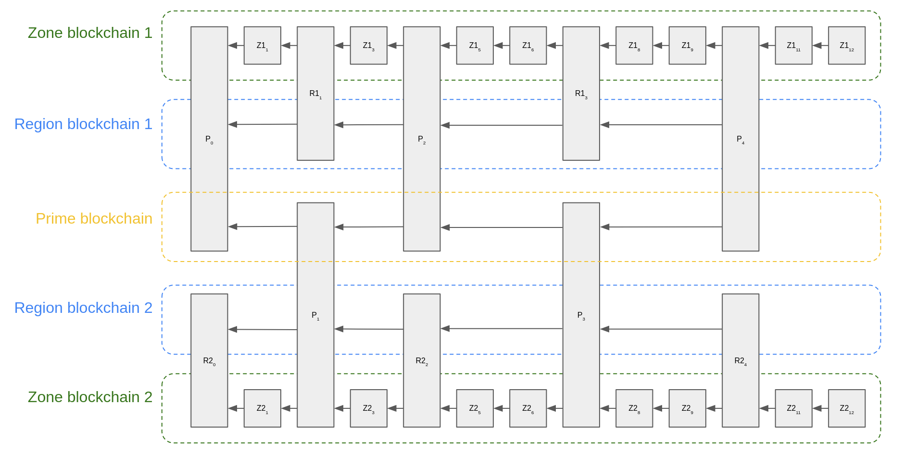
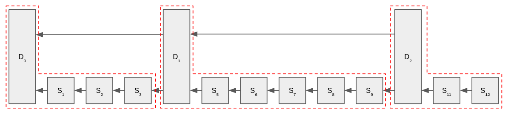
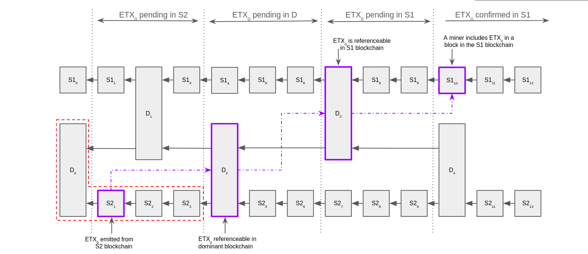
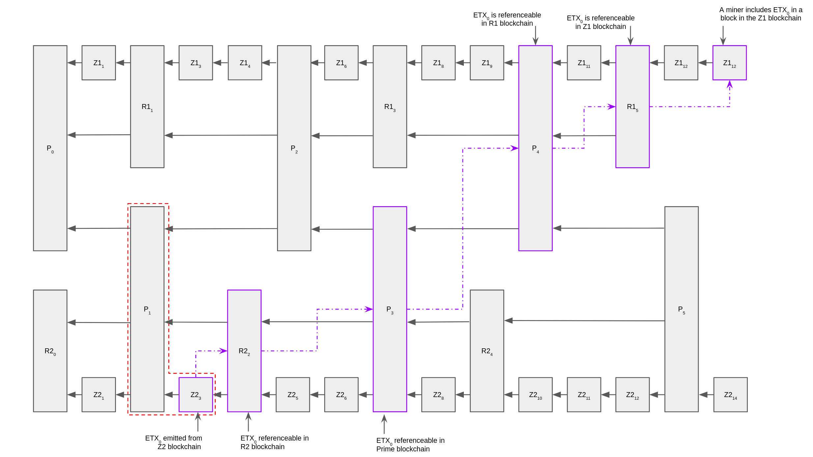

```
  QIP: 5
  Layer: Consensus (hard fork)
  Title: Cross Shard Transactions
  Author: wizeguyy <wizeguyy+qip@quai.org>
  Comments-Summary: No comments yet.
  Comments-URI: https://github.com/quainetwork/qips/wiki/Comments:QIP-0005
  Status: Draft
  Type: Standards Track
  Created: 2023-11-29
  License: BSD-2-Clause
```

## Abstract
This specification describes a way to transmit value and data between the various shards described in [qip-0002](qip-0002.md) which is compatible with the consensus protocol.

## Motivation
The consensus protocol accommodates high transactional throughput by sharding the state of each ledger across 'zone' chains, in the hierarchy of chains. Each zone processes transactions corresponding to two token ledgers; the Quai and Qi tokens. The consensus protocol guarantees agreement over the state of each chain, and by extension the state of both ledgers. Without a mechanism to communicate between the different shards, each ledger in each chain would become economically isolated from the each other, and there would not be fungibility across shards (coins in shard-A may be preferred over coins in shard-B). To prevent this economic isolation, we propose Cross Shard Transactions as a mechanism to transmit value and data between the different shards.

## Terminology
The following terms will be used extensively in this specification:
* Coincident Block - a block which is acceptable by multiple chains in the hierchy. For example, a region block produced by zone-0 will coincide with the region-0 blockchain.
* Destination Shard - the shard which is destined to process the ETX, once it has become referencable across the network.
* External Transaction (a.k.a. ETX) - a transaction which transmits value or data across shards.
* Internal Transaction (a.k.a. ITX) - a transaction which only affects the state of a single shard.
* External Transactions Root - the root hash of ETXs emitted by a given block.
* Far-Coordinate Blockchains - any two blockchains which merge mine into different dominant chains, but exist within the hierarchy of merge-mined chains.
* Near-Coordinate Blockchains - any two paralell blockchains which merge mine into the same dominant blockchain.
* Origin Shard - the shard which originates a ETX.
* Shard - a fragment of the overall distributed ledger.
* Subordinate Block Manifest - the list of blocks which has happened in a subordinate chain, since that chain's previous coincident block (inclusive).

## Specification
### Overview
Our system maintains two token ledgers (Qi & Quai) and each ledger is sharded across some number of shards defined by [qip-0002](qip-0002.md). The consensus protocol guarantees agreement over the sequence of transactions in each shard, and thus the state of each ledger across all its shards. Each shard needs a mechanism to transmit value and/or data between each other without violating the consensus properties of the network. More precisely, an ETX transmitting data across shards must atomically succeed or fail in the event of a chain reorganization impacting any of the involved shards. For example, if an ETX transmits value from zone-0 to zone-1, that transaction must not succeed in zone-1 if the originating transaction in zone-0 has been reverted due to a chain reorganization in zone-0. We accomplish this atomicity through the use of subordinate block manifests.

In a nutshell, the following sequence of events must occur to process an ETX across shards:
1) the so-called origin chain must process a transaction which emits an ETX.
1) the origin chain must mine a coincident block which commits to the origin block in its subordinate block manifest.
1) the destination chain must mine a coincident block which commits to the origin chain's coincident block.
1) the destination chain must then add the newly referencable ETXs as available to be processed.
1) a miner may now mine a block which processes that ETX in the destination chain.

#### Merge-mined Chains
Since shards are spread across multiple chains, it is useful to provide an illustration of a subordinate chain merge-mined with a dominant chain.

> Image 1: the simplified case with one dominant chain and one subordinate chain merge-mined together.


> Image 2: illustration of two subordinate chains (S1 & S2) merge mining into one dominant chain (D).


> Image 3: an extended case, illustrating two far-coordinate subordinate chains (Z1 & Z2) merge mining into distinct region chains (R1 & R2) as well as the global Prime chain.

### External Transactions
An external transaction is a message emitted from one shard, to be processed by another shard. These messages are not signed by users, like ordinary transactions are, but rather are emitted by a shard in response to certain events. The simplest reason a shard might emit an ETX, is if a user submits a transaction which attempts to transfer coins from his account to an account which resides in a different shard. More advanced usecases may exist however, and it is possible that a single transaction in the origin shard may result in many ETXs being emitted from that shard.

#### ETX Authentication
If an ETX is emitted by a shard, rather than broadcast by a user, then there cannot be authenticated via cryptographic signature, because it is not possible for the shard to have a secret key. Instead, an ETX omits the signature field, and the destination chain instead will look for proof that the origin chain indeed emitted an ETX, before allowing that ETX to be processed at the destination. This proof will be discussed in subsequent sections.

#### ETX Structure
There may be many forms of ETXs, therefore this spec should not be overly prescriptive. In general, any ITX may have a corresponding ETX with identical structure, but without a signature.

#### Block Structure
Each block should include a list of ETXs which it emits. This list will be composed into a merkle tree and committed into the header as the ETXRootHash. Region and Prime blocks are not allowed to process transactions, and therefore are not allowed to emit ETXs. Therefore, the ETX list and the ETXRootHash will only be present in zone chain blocks.

### Subordinate Block Manifests
The subordinate block manifest is a data structure necessary to concisely prove the source of origin of an ETX. The subordinate manifest is used by a dominant chain to describe the sequence of subordinate blocks which have occurred been accepted in the subordinate chain since its previous coincident block with the dominant chain. This data structure is built by the subordinate chain, and committed to in the block header.


> Image 4: Block manifests (grouped in red) describe the subordinate manifest of the next dominant block. For example, the subordinate manifest in block D1 contains the hashes of blocks [D0, S1, S2, S3].

#### Block Structure
Blocks in the dominant chain will include the manifest as a list of block hashes, where the first is the hash of the previous coincident block from the subordinate chain, and the last is the hash of the subordinate block immediately preceding the given coincident block.

Since the subordinate blocks do not exist in the dominant chain (with the exception of the previous coincident block), the dominant chain cannot verify the sequence. Therefore it falls on the subordinate chain to build the manifest and commit to it in the block header, by composing the list into a merkle tree and recording the merkle root in the header. The dominant chain must verify that the first hash in the manifest is indeed the most recent coincident block from that subordinate chain, and that the full list of block hashes matches the merkle root in the header.

#### Consensus Considerations
This is compatible with the consensus protocol. Since the dominant chain ensures that the first block in the manifest is indeed the prior coincident block from that subordinate chain, it is not possible for a coincident block to be accepted with an outdated or detached manifest. Secondly, since the subordinate chain builds and verifies the manifest in its chain, a block which attempts to commit to an incorrect manifest would be rejected by the subordinate chain and reorganized out.

### Cross Shard Referencing
Before an ETX can be accepted at the destination shard, it must be referencable through the hierarchy of chains, via block manifests. In order to reference the block which emits an ETX, the destination chain must confirm the following:
So, I think discussion about how inbound ETXs are processed at the destination should be left out of this spec.* the ETX was emitted by a block in the origin chain
* the origin block is listed in the subordinate manifest of a block in the dominant chain
* the destination chain has committed to the dominant block through which it can be referenced
  * i.e. the destination chain has mined a coincident block decending from the referencing dom block.

#### 2-Level ETX Example

> Image 5: illustration of the lifecycle of an ETX

Image 5 gives an illustration of the lifecycle of an ETX. In this example, with two subordinate chains (S1 & S2) merge mining into one dominant chain (D), an ETX traverses from S2 to S1 in the following phases:
1) Block S2_1 emits an ETX from the S2 blockchain.
1) Block D_2 commits the S2 subordinate manifest into the dominant blockchain, D.
1) Block D_3 commits the S2 subordinate manifest into the S1 blockchain.
1) Block S1_10 processes the ETX in the S1 blockchain, thereby completing the transfer.

Note, there is one short circuit condition. Since there are two native ledgers and both ledgers are sharded across each chain, each chain actually runs two shards. In the case where one shard emits an ETX destined to a shard operated by the same chain, it is possible for that ETX to be mined in immediately in the same block in the destination ledger, since it is immediately referencable without needing to prove a cross-chain reference through manifests. In this case, the ETX would not get added to the list of emitted ETXs.


> Image 6: extended illustration of the lifecycle of an ETX in a hierarchical merge-mined setting.

#### Far-Coordinate ETX Referencing
Thus far, this specification has focused on a simplified 2-level structure of merge mined chains; two subordinate chains (on the lower level) merge mined with one dominant chain (on the upper level). The subordinate chains in this case are considered near-coordinate: they are parallel chains who share a common dominant chain. The Quai protocol actually defines a three level hierarchy of merge mined chains, and thus we need to extend the notion of cross-shard referencing to account for shards belonging to far-coordinate chains (chains which do not share a common dominant chain).

When ETXs from a subordinate chain become referencable in the dominant chain, there are two possibilities for handling each ETX from that chain:
1) some ETXs may be destined for a near-coordinate chain, and thus will be processed by the destination chain when it finds a coincident block.
1) other ETXs may be destined for a far-coordinate chain, and thus need to be emitted from the dominant chain to its dominant chain.

Each dominant chain may itself be a subordinate to some higher level dominant chain. Thus, dominant chains also build a subordinate block manifests, emit ETXs to their dominant chain, and commit to those ETXs in their own ETX root hash. Since merge-mining requires the block header to be acceptable in every level of the hierarchy, the header must contain the subordinate manifest hash and ETX hash for each subordinate level in the hierarchy.

Concretely, the Quai protocol specifically describes a 3xN hierarchy of chains, with 3 levels named Prime, Region, and Zone. The prime chain is the root of the hierarchy, with some number of region chains underneath, all merge-mining into Prime. Each region chain has some number of zone chains underneath, all merge-mining into their prescribed region chain. Thus, the header must accommodate two levels of subordinate manifests, and two levels of ETX hashes:

For the 3 level merge-mined hierarchy, the header must contain the following additional data:
```
{
  RegionManifestHash:   []byte, // Root hash of region block manifest since that region's prior prime coincidence
  ZoneManifestHash:     []byte, // Root hash of zone block manifest since that zone's prior region coincidence
  RegionETXHash:        []byte, // Root hash of ETXs emitted from the region to a far-coordinate zone
  ZoneETXHash:          []byte, // Root hash of ETXs emitted from the zone to any near or far coordinate chain
}
```

## Copyright
This QIP licensed under the BSD 2-clause license.
