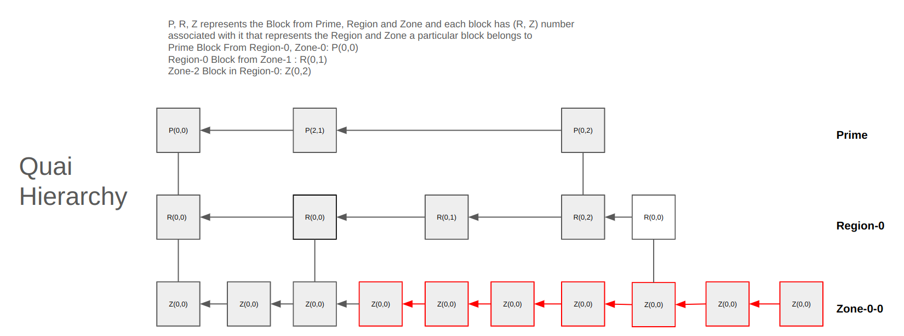
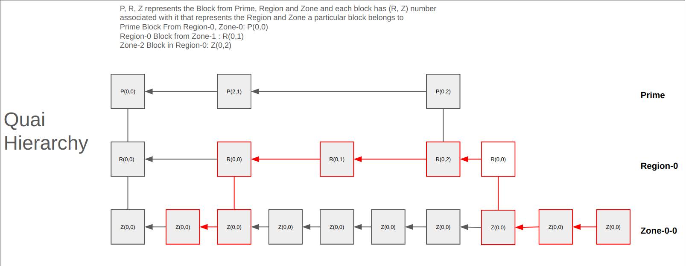
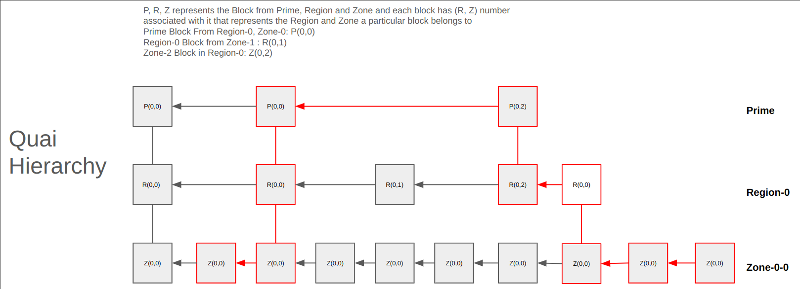
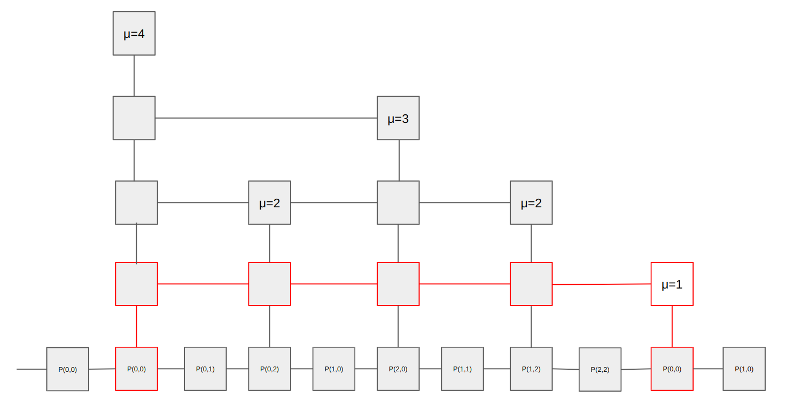
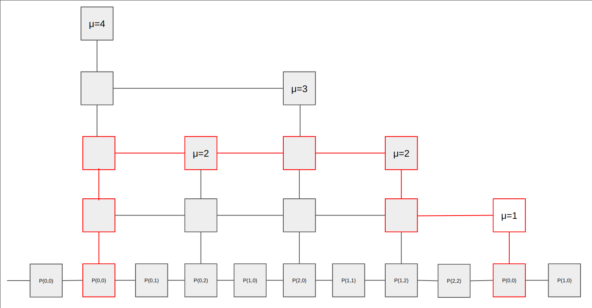
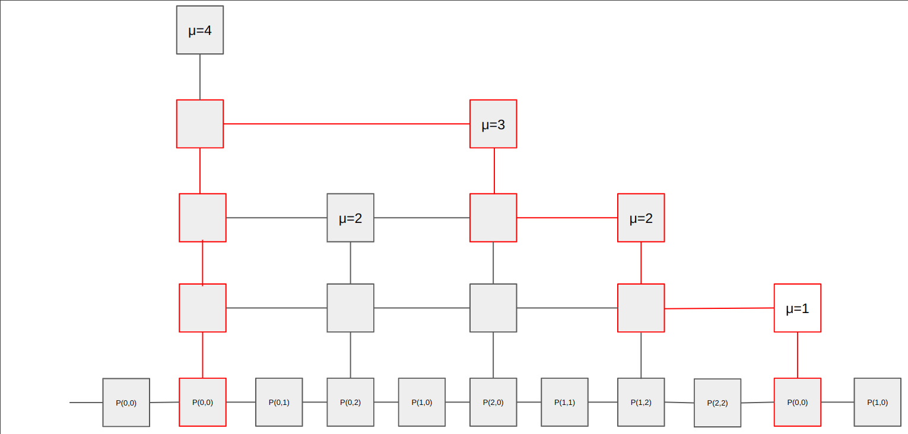

 ```
  QIP: 9
  Layer: Consensus (hard fork)
  Title: Interlinks in Quai
  Author: gameofpointers <gameofpointers@proton.me>
  Comments-Summary: No comments yet.
  Comments-URI: https://github.com/quainetwork/qips/wiki/Comments:QIP-0009
  Status: Draft
  Type: Standards Track
  Created: 2023-11-16
  License: BSD-2-Clause
 ```

## Abstract

This QIP defines a block interlink structure to be used in Quai as described in
[1] with few modifications.

## Motivation

Interlink structure defined in this QIP will enable proof generation and
verification of a transaction inclusion in a Block at a depth for which the
light node(SPV client) doesn't have the state to verify, work based snap sync
for faster sync. This requires using only O(log(N)) headers instead of the whole
chain history.

## Specification

### Definitions
1. $Order(O)$ -> Quai blockchain is merged mined hierarchy of blockchains organized into different levels, Prime, Region and Zone. Prime has a order of 0, Region has order of 1, Zone has order 2. Order of a Block(B) is defined as $O(B)$. $O(B_p)=0$, $O(B_r)=1$, and $O(B_z)=2$. The organization of the levels and merged mining is explained in the [qip0005](qip-0005.md) spec.
  2. $Intrinsic Difficulty (id)$ -> $l  - \log_2(H(B))$, where $l$ is the length
  of the hash field, and $H(B)$ is hash of the Block.

### Rank ($\mu$) of a Block
Proof-of-Work function of a Valid Block in the blockchain satisfies the Mining Target(T) i.e $id \leq T$ . Traditional Interlinks are organized into different levels. If $id \leq
\frac{T}{2^{ 2^{\mu}}}$ we say the block is of rank $\mu$. This is a small
deviation from the equation in [1] $id \leq \frac{T}{2^{\mu}}$. Since Quai has
three layers namely Prime, Region, Zone. Prime chain acts as the base chain and
has rank of 0. Region chain has a rank of -1 and Zone chain has a rank of -2 by
definition.

Genesis Block is set to have $id=0$ and $\mu=\inf$.

## Specification

### Interlink Data structure

Interlinks of a Block is an array of hashes of the previous interlink block at each rank between 1 and max length of $L$.

$\text{InterLinks}[\mu-1]$, $0 <= len(Interlinks) <= L $

where,

$\text{InterLinks[i]} = \text{Previous Prime Block with } id \leq \frac{T}{2^{2^i}}$  

This QIP proposes to add new field to the header:
* InterlinkRootHash - Patricia Merkle root of the interlinks array. This will be recomputed and verified on each prime block. Interlinks structure is stored in the body of the block.

```{go}
Header {
  ...
  InterlinkRootHash Hash
  ...
}
Body {
  ...
  Interlinks []Hash
  ...
}
```

## NiPoPoW

Paper [1] goes over how NiPoPoW proof generation and verification can be done in
a single chain setting. In [1] the proof is separated into two parts, suffix
proofs and infix proofs. 
1. Suffix proofs show the link to the highest rank of interlink close to the
Block that also satisfies the $m$ (security parameter). $m$ refers to the
minimum number of Interlink blocks at a particular rank needed to generate the
suffix proof. If we don't have atleast $m$ blocks from a particular rank, we
default to $\mu=-2$, i.e generating the proofs with just the zone blocks.  2.
Infix proofs shows the link between the Block for which the proof is generated
to the first block that satisfies the $m$ criteria.

### NiPoPoW structure

NiPoPoW includes
Continuous chain of headers that attach the Block to the chain Tip (i.e suffix
proof + infix proof) and also satisfies the $m$ security parameter and
InterLinks structure commited to in each of those headers.

```{go}
NiPoPoW {
  ProofHeaders  []header
  InterLinks []InterLinks
}
```
### Suffix and Infix Proofs

The few examples below go through the different cases of generating the infix
proofs and suffix proofs in Quai for various $m$ values.

* **Case 1** : Proofs with just the Zone Blocks 

 If $m=3$ and the there are not enough Region blocks between the Block and the current head. 
* **Case 2**: Proofs with just Zones and Regions 

  If $m=3$ and the block to be used for proof was the last highlighted block. While tracing back, go up to region and stay there until the $m=3$ is met and come down to link the Zone.
* **Case 3**: Proofs with just Zones, Regions and Primes but no Interlinks 

 If $m=2$, while tracing back from the zone, go up to region and go up to Prime
 and come down after meeting $m=2$ and get to the Zone.
* **Case 4**: Proofs with Interlinks, this is an extension of the **Case3**. To understand this better look at the image below, it describes the interlink levels. There are 4 ranks of interlinks, the frequency of occurance is dependent on the $k$ and $\mu$ value. If $m=5$, to generate suffix proofs would have to take the path marked in Red as $\mu=1$ is the highest rank that satisfies the $m$ requirement.


  If $m=4$ 
  
   this would be the path taken with highest rank being $\mu=2$

  If $m=2$ 
  
   this would be the path taken with highest rank being $\mu=3$

  The same treatment applies to $\mu \ge 3$, based on the value of $m$.

## Verifier Execution

Verifier is a node/blockchain interface sdk that does not have a complete
knowledge of the blockchain and has to verify and pick the best proof from the
honest party between a pool of Proofs provided by the Honest parties or the
Adversary. Adversary is a node that generates invalid proofs.

Let $P$ be the pool of proofs and verifier has to pick the honest party proof with a high probability.
1. Check that the proof has continuous chain of blocks using the corresponding
InterLinks
2. Best proof is the proof with highest amount of entropy removed.

## Parameter L

We should pick the Number of Levels of Interlinks $L$ to be 4. That means the
Interlinks will have (threshold + 2, 4, 8, 16) extra bits. This gives a good
work compression and good range Interlink frequency in the order of days as well as
years.

## Future work
Snap Sync using interlinks will be proposed in a future QIP.

## References

[1]: Non-Interactive Proofs of Proof-of-Work  https://eprint.iacr.org/2017/963.pdf

[2]: Proofs of Proofs of Work https://fc16.ifca.ai/bitcoin/papers/KLS16.pdf

## Copyright

This QIP licensed under the BSD 2-clause license.
