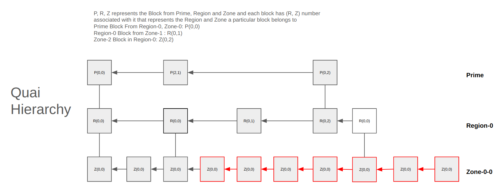
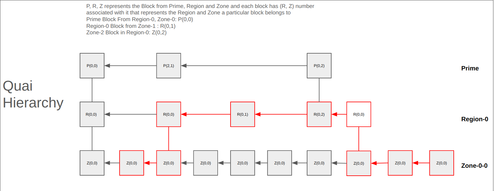
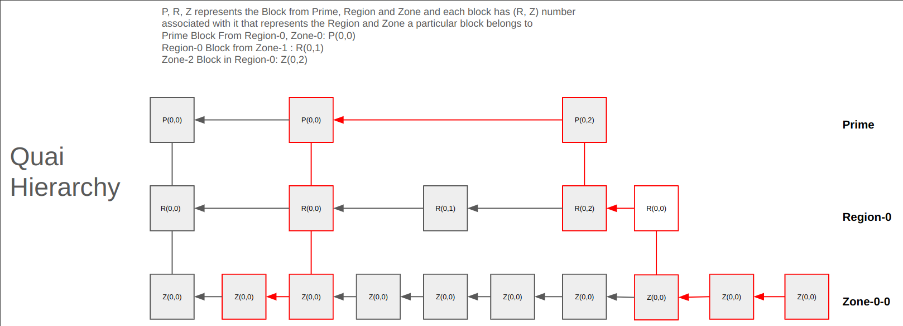
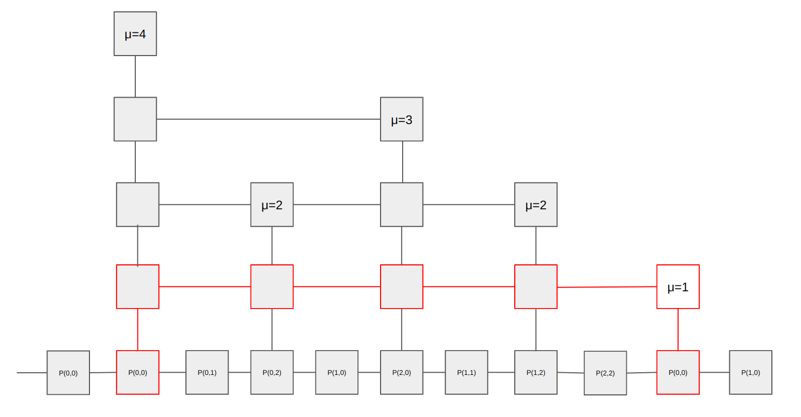
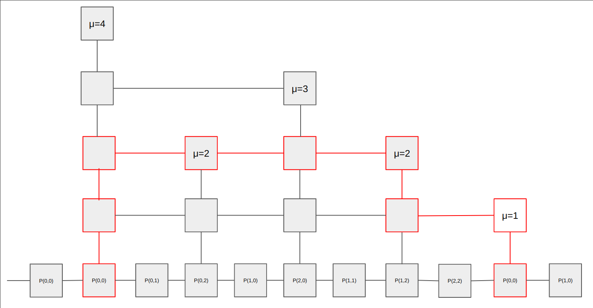
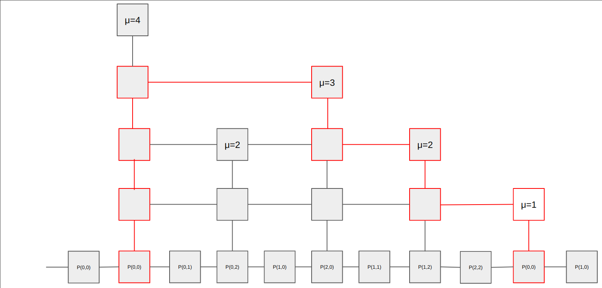

 ```
  QIP: 9
  Layer: Consensus (hard fork)
  Title: Interlinks in Quai
  Author: gameofpointers <gameofpointers+qip@quai.org>
  Comments-Summary: No comments yet.
  Comments-URI: https://github.com/quainetwork/qips/wiki/Comments:QIP-0009
  Status: Draft
  Type: Standards Track
  Created: 2023-11-16
  License: BSD-2-Clause
 ```

## Abstract

This QIP defines a block interlink structure to be used in Quai as described in
[1] with few modifications.

## Motivation

To Prove/Verify the Proof Of Work done on Quai since the genesis using a
non-interactive proof of proof of work (NiPoPoW). Also verify a transaction inclusion in a Block at a depth for which the light node(SPV client) doesn't have the state to verify. This requires using only
O(log(N)) headers instead of the whole chain history. Specifically in Quai, the plan is to use interlinks for work based
snap sync and to use nodes as trustless RPC providers.

## Specification

### Definitions
1. $Order(O)$ - Quai blockchain is merged mined hierarchy of blockchains organized into different levels, Prime, Region and Zone. Prime has a order of 0, Region has order of 1, Zone has order 2. Order of a Block(B) is defined as $O(B)$. $O(B_p)=0$, $O(B_r)=1$, and $O(B_z)=2$. The organization of the levels and merged mining is explained in the [qip0005](qip-0005.md) spec.

### Overview

Interlink data structure is a skip-list that helps a verifier to process a
sparse subset of the blockchain.

Proof of Work function of a Valid Block in the blockchain satisfies the Mining Target(T) i.e $id \leq T$ . 

Traditional Interlinks are organized into different levels. If $id \leq
\frac{T}{2^{k \times \mu}}$ we say the block is of rank $\mu$. k is a compression
parameter and determines the range between interlinks. This is a small
deviation from the equation in [1] $id \leq \frac{T}{2^{\mu}}$. Having a bigger
range between interlink levels helps with proof compression while preserving
the security guarantees.Rank in Quai is analogous to Level in paper[1]. Since Quai has three layers namely Prime, Region, Zone. Prime chain acts as the base chain and has rank of 0. Region chain has a rank of -1 and Zone chain has a rank of -2 by definition. [1] defines $\mu$ for a block $B$ as $$\mu=\log(T)-\log(id(B))$$
This changes in Quai to $$\mu=\frac{\log(T)-\log(id(B)}{k} $$ For blocks with rank higher than Prime ($\mu=0$).

Genesis Block is set to have $id=0$ and $\mu=\inf$.

Now for the implemention of interlinks in Quai it's established that,
* Frequency of interlink computation will be on every Prime Block
* The Target used to calculate the Interlinks will be the  $T_p$. ($T_p$ is the Target used to determine if the block is a prime block).  All interlink hash calculations will be done on this Target.

## Implementation

Given the understanding of this theory, for a given k, and num of levels(L) the interlink data structure would look like this.

```{go}
type InterLinks []Hash
```

This QIP proposes to add new field to the header:
* Merkle root of the interlink. This will be used to store/reference the interlink data structure. This will be stored in the body of the block.

```{go}
type Header struct {
  ...
  ...
  interlinkRootHash Hash
  ...
  ...
}
```

For any valid block in the Quai blockchain, rank can be calculated and Logic to calculate the rank of a block is given below.
```
1: block
2: function CalculateRank(block)
3:    if Order(block) != 0 then
4:        if Order(block) == 1 then
5:            return -1  // Region blocks have a Rank of -1
6:        else if Order(block) == 2 then
7:            return -2  // Zone blocks have a Rank of -2
8:        else
9:            return undefined
10:       end if
11:   rank ← 0
12:   primeTarget ← 2^256 / block.PrimeDifficultyThreshold
13:   for i from 0 to l do
14:       id ← miningTarget / 2^(k*i)
15:       mu ← floor((log(primeTarget) - log(id)) / k)
16:       if mu > rank then
17:           rank ← mu
18:       end if
19:   end for
20:   return rank
21: end function

```

Logic to update the Interlink root for a given block is given below.
``` 
1: function UpdateInterlinkRootHash(block)
2:    if Order(block) != 0 then
3:        return undefined  // Return undefined if the block order is not 0
4:    end if
5:    newInterLink ← Copy(block.InterLink)  // Copy the existing InterLink of the block
6:    rank ← CalculateRank(block)  // Calculate the rank of the block
7:    for i from 0 to rank - 1 do
8:        newInterLink[i] ← block.Hash  // Update the InterLink entries up to the calculated rank with the block's hash
9:    end for
10:   return MerkleRoot(newInterLink)  // Return the Merkle root of the updated InterLink
11: end function

```

The functions will enable Update of interlinks. Next sections describe the Prover and Verifier design using Interlinks.

## Prover and Verifier Design

Benefit of using non interactive proofs is that a verifier that doesn't have the state of the blockchain can confirm with a very high probability that a transaction was included in a particular Block. Since this process is non interactive there are two independent parties that participate in this process. **Prover** and **Verifier**. Prover produces the proofs, and Verifier verifies the proof. Logic of Prover proof generation and Verifier verification of the collection of proofs is shown in sections below.

Paper [1] goes over how this can done in a single chain setting. In [1] the proof is separated into two parts, suffix proofs and infix proofs. Suffix proofs show the link to the highest rank of interlink close to the Block that also satisfies the $m$ (security parameter). $m$ refers to the minimum number of Interlink blocks at a particular rank needed to generate the suffix proof. If we don't have atleast $m$ blocks from a particular rank, we default to $\mu=-2$, i.e generating the proofs with just the zone blocks. In Quai the proof generation process has additional steps since Quai already has sparse interlinks in the Hierarchy of merge mined chains named Prime and Regions.  If the highest $\mu$ in the proof is greater than $-1$ we need to show the link from the Prime to the Zone Block (Stateful Blocks in Quai) on both ends.

### Definitions
In order to describe the proof generation process few definitions of functions and terminologies that interface with the Blockchain are required. These will be listed below along with the helper methods and are used subsequently in the algorithms to generate the proof and verification of proofs.

* **currentHead()** : Returns the current head of the Zone chain that the prover starts from
* **ParentHeader(order)** : Returns the parent header of the block at a given order
* **Number(order)** : Returns the number commited to in the header at a given order
* **GetHeader(number/Hash, order)** : Returns the Header stored for  a given Number in Canonical Chain or Hash for a given order
* **MerkleProof(Header, txHash)**: Returns the MerkleProof required to prove the validity of  the txHash in Header. To understand this more [Proofs in Patricia merkle tries](https://ouvrard-pierre-alain.medium.com/merkle-proof-verification-for-ethereum-patricia-tree-48f29658eec)
* **Interlink(rank)** : Returns the interlink data structure stored at a particular prime block. It can take an input of rank and return the hash stored at that rank of Interlink.
* **children** : Block that is subsequent to a given block and present in the canonical tree of blockchain
* **Reverse()** : Returns the given array in opposite order, If the order of headers in proof is going forward, any heade collected using a backward tracing should use this function to get headers in order.
* **Hash** : Returns the hash of a given header and also is a data structure
* **ParentHashArray()** : Returns the parent hash array stored in a given header, it has a length of three and index 0 points to the Previous Prime Parent, index 1 points to the Previous Region Parent and index 2 points to the Previous Zone Parent.
* **IntrinsicWork()** : Returns the $256-log_2(powHash)$ of a given header


New data structure is needed for the proofs, It has to be able to store a Array of headers that attach the Block to the Tip, MerkleProof of inclusion of tx hash in the Block, and txHash
```{go}
type Proof struct {
  proofHeaders  []header
  merkleProof   MerkleProof
  txhash        Hash
}
```
### Prover Execution

To understand the generalized proof generation it is useful to understand the different cases in which Proof generations needs to work. For each case, a image is attached for better clarity and will be helpful in understanding the algorigthms. The cases might be presented in a simple way for the convenience of understanding and clarity. $m$ values are small as well for the same reason and in real proofs they will be large.

* **Case 1** : Proofs with just the Zone Blocks 

 If $m=3$ and the there are not enough Region blocks between the Block and the current head. 
* **Case 2**: Proofs with just Zones and Regions 

  If $m=3$ and the block to be used for proof was the last highlighted block. While tracing back, go up to region and stay there until the $m=3$ is met and come down to link the Zone.
* **Case 3**: Proofs with just Zones, Regions and Primes but no Interlinks 

 If $m=2$, while tracing back from the zone, go up to region and go up to Prime and come down after meeting $m=2$ and get to the Zone.
* **Case 4**: Proofs with Interlinks, this is an extension of the **Case3**. To understand this better look at the image below, it describes the interlink levels. There are 4 ranks of interlinks, the frequency of occurance is dependent on the $k$ and $\mu$ value. If $m=5$, to generate suffix proofs would have to take the path marked in Red as $\mu=1$ is the highest rank that satisfies the $m$ requirement.


  If $m=4$ 
  
   this would be the path taken with highest rank being $\mu=2$

  If $m=2$ 
  
   this would be the path taken with highest rank being $\mu=3$

  The same treatment applies to $\mu \ge 3$, based on the value of $m$.

To accomplish this few algorithms are defined below, in this section the algorithms are listed. Using the images from the cases above it is shown what the purpose of each of these algorithms serve

* GenerateProof() : This is the main algorithm that generates the proof for a  given value of m. It calls GenerateSuffixProof() and GenerateInfixProof() to complete the proof.
* GenerateSuffixProof(): This algorithm traces the blockchain up until the condition on $m$ is met. This only traces up and doesn't come down. This can be seen in the images shown for **Case1**, **Case2** and **Case3**. There is another general algorithm defined followUpBackward() that does the tracing from the current rank to a end rank defined. Using the followUpForward() which defines the stopping point for the Proof, it traces the interlinks as defined in **Case4**.
* GenerateInfixProof(): This algorithm traces down from the end of the suffix proof execution till the Block is reached. Using the followUpForward(), it collects the headers along the way to the rank <= 0 and also returns the MerkleProof associated with the Block and tx(transaction). This gets added to the result from followDown() that connects the Last suffix proof to the end of followUpForward execution.


NOTE: All the algorithms are written for clarity and there are probably ways to optimize them. But the end result should follow the tracing shown in the cases above.

```{go}
1: function GenerateProof(Header, txHash, m)
2:    (suffixProof, highestRank) ← GenerateSuffixProof(Header, m)
3:    
4:    if highestRank < 0 then
5:        Initialize firstHeader, lastHeader as header
6:        Initialize suffixProof, infixProof, and tailProof as empty arrays of headers
7:        
8:        if highestRank == -1 then
9:            (tailProof, firstHeader) ← followUpBackward(1)
10:           (infixProof, lastHeader) ← followUpForward(Header, txHash, 1)
11:       else if highestRank == -2 then
12:           firstHeader ← currentHead()
13:           lastBlock ← Block
14:       end if
15:       
16:       for i from lastBlock.Number(highestRank) to firstBlock.Number(highestRank) do
17:           suffixProof ← append(suffixProof, GetHeader(i, highestRank))
18:       end for
19:       return Proof{proofHeaders: append(infixProof, suffixProof, Reverse(tailProof)), merkleProof: MerkleProof(Header, txHash), txHash: txHash}
20:   else
21:       (infixProof, merkleProof) ← GenerateInfixProof(Header, txHash, suffixProof[0])
22:   end if
23:   
24:   return Proof{proofHeaders: append(infixProof, suffixProof), merkleProof: merkleProof, txHash: txHash}
25: end function
```

```
1: function GenerateSuffixProof(Header, m)
2:    zoneDistance ← Header.Number(Zone) - currentHeader.Number(Zone)
3:    startRank ← -2
4:    
5:    if zoneDistance >= m then
6:        (_, firstRegion) ← followUpBackward(1)
7:        (_, lastRegion) ← followUpForward(Header, txHash, 1)
8:        regionDistance ← firstRegion.Number(Region) - lastRegion.Number(Region)
9:        
10:       if regionDistance >= m then
11:           startRank ← startRank + 1
12:           
13:           (_, firstPrime) ← followUpBackward(0)
14:           (_, lastPrime) ← followUpForward(Header, txHash, 0)
15:           primeDistance ← firstPrime.Number(Prime) - lastPrime.Number(Prime)
16:           
17:           if primeDistance >= m then
18:               startRank ← startRank + 1
19:           end if
20:       end if
21:   end if
22:   
23:   if startRank < 0 then
24:       return ([]headers, startRank)
25:   end if
26:   
27:   (suffixProof, firstPrime) ← followUpBackward(startRank)
28:   (_, lastPrime) ← followUpForward(Header, txHash, startRank)
29:   
30:   interlink ← firstPrime.Interlink()
31:   maxRank ← 4
32:   highestRank ← startRank
33:   interlinksAtRank ← []headers
34:   
35:   for k from maxRank down to 0 do
36:       interlinksAtRank ← InterlinkHeadersForRank(firstPrime, lastPrime, k)
37:       if len(interlinksAtRank) >= m then
38:           highestRank ← k
39:           break
40:       end if
41:   end for
42:   
43:   return (append(Reverse(interlinksAtRank), Reverse(suffixProof)), highestRank)
44: end function

```

```
// Goes though a rank of interlinks from a startHeader to the endHeader 
// and return the interlink headers
1: function InterlinkHeadersForRank(startingHeader, endHeader, rank)
2:    Initialize interlink as Interlink
3:    Initialize index as integer
4:    interlink ← startingHeader.Interlink()
5:    
6:    if rank == 0 then
7:        interlink ← startingHeader.ParentHashArray()
8:    end if
9:    
10:   Initialize interlinkHeaders as an empty array of headers
11:   
12:   while true do
13:       parentAtLevel ← GetHeader(interlink[rank])
14:       if parentAtLevel.Number(rank) < endHeader.Number(rank) then
15:           break
16:       end if
17:       interlink ← parentAtLevel.Interlink()
18:       if rank == 0 then
19:           interlink ← parentAtLevel.ParentHashArray()
20:       end if
21:       interlinkHeaders ← append(interlinkHeaders, parentAtLevel)
22:   end while
23:   
24:   return interlinkHeaders
25: end function

```

```
1: function followUpBackward(endOrder)
2:    start ← currentBlock()  
3:    order ← Order(start)  
4:    suffixProof ← []headers // Initialize suffixProof as an empty array of headers
5:    parent ← start.ParentHeader(order)  // Get the parent header at the current order

6:    if order <= endOrder then
7:        currentDomLookupLevel ← Order(start) - 1
8:        
9:        while true do
10:           if order < currentDomLookupLevel then
11:               if order == endOrder then
12:                   break
13:               end if
14:               currentDomLookupLevel ← currentDomLookupLevel - 1
15:           end if
16:           
17:           // Query the Dom chain database to get the parent at a given order
18:           parent ← parent.ParentHeader(currentDomLookupLevel + 1)
19:           order ← Order(parent)
20:           suffixProof ← append(suffixProof, parent)
21:       end while
22:   end if
23:   
24:   return (suffixProof, parent)
25: end function

```

Infix Proofs tie the Block for which the Tx inclusion has to be proved to the Last Interlink block from the Suffix Proof. Similar to the Suffix proof  an extra step for Quai will be to trace forward until Prime is reached before using the Interlinks to reach the Last Interlink Block. Since Block number is continuous and increasing we can use that to trace forward to reach the prime block. Infix proofs are only required to be computed when we have to trace the interlinks.

```{go}
1: function GenerateInfixProof(Header, txHash, lastSuffixHeader)
2:    (infixHeaders, lastPrime) ← followUpForward(Header, txHash)  // Get headers and the last prime by moving forward in the chain
3:    
4:    // Reverse the headers obtained from following down the chain from the last suffix header to the last prime
5:    reversedHeaders ← Reverse(followDown(lastSuffixHeader, lastPrime))
6:    
7:    // Append the reversed headers to the infix headers
8:    infixHeaders ← append(infixHeaders, reversedHeaders)
9:    
10:   // Generate a Merkle proof for the given header and transaction hash
11:   merkleProof ← MerkleProof(Header, txHash)
12:   
13:   return (infixHeaders, lastPrime, merkleProof)
14: end function

```
```
1: function followDown(startHeader, endHeader)
2:    currentHeader ← startHeader  // Initialize currentHeader with startHeader
3:    prevHeader ← startHeader  // Initialize prevHeader with startHeader
4:    currentRank ← CalculateRank(currentHeader)  // Calculate the rank of the currentHeader
5:    Initialize followDownHeaders as an empty array of headers

6:    while true do
7:        if currentHeader.Number > endHeader.Number then
8:            if currentRank > 0 then
9:                currentRank ← currentRank - 1
10:           else
11:               currentRank ← 0
12:           end if
13:       else
14:           // Only update prevHeader if we are allowed to go backwards
15:           prevHeader ← currentHeader
16:           followDownHeaders ← append(followDownHeaders, currentHeader)
17:       end if
18:       
19:       // Get the header referenced in the interlink of prevHeader at currentRank
20:       currentHeader ← GetHeader(prevHeader.Interlink(currentRank))
21:       
22:       if currentHeader.Hash == endHeader.Hash then
23:           break
24:       end if
25:   end while
26:   
27:   return followDownHeaders
28: end function

```

```
1: function followUpForward(Header, txHash, endOrder)
2:    Initialize infixHeaders as an empty array of headers
3:    order ← Order(Block)  // Get the order of the current block
4:    infixHeaders ← append(infixHeaders, Block)  // Add the current block to infixHeaders
5:    children ← Header  // Initialize children with Header
6:    var lastHeader as Header

7:    if order <= endOrder then
8:        while true do
9:            if order == endOrder then
10:               lastHeader = children
11:               break
12:           end if
13:           
14:           headerNumber ← children.Number(order)
15:           children ← GetHeader(headerNumber + 1)
16:           childrenOrder = Order(children)
17:           
18:           // Move up a level if a dominant header is found
19:           if childrenOrder > order then
20:               order = childrenOrder
21:           end if
22:           infixHeaders = append(infixHeaders, children)
23:       end while
24:   else
25:       lastHeader = Header
26:   end if
27:   
28:   return (infixHeaders, lastHeader)
29: end function

```


## Verifier Execution

Verifier is a node/blockchain interface sdk that does not have a complete knowledge of the blockchain and has to verify and pick the best proof from the honest party between a pool of Proofs provided by the Honest parties or the Adversary. Adversary is a node that generates invalid proofs.

Let $P$ be the pool of proofs and verifier has to pick the honest party proof to verify the Transaction execution in a Block. PickBestProof algorithm below describes the process. It does three things, 
 * Checks if the proof is valid
 * Check that the proof has continuous chain of blocks
 * Compares the total intrinsic bits of entropy from all the proofs and picks the best proof

```
1: function PickBestProof(P)
2:    bestIntrinsic ← -1  // Initialize best intrinsic value as -1
3:    var bestProof as Proof  // Initialize bestProof

4:    for each proof in P do
5:        if IsProofContinuous(proof) then
6:            if IsProofValid(proof) then
7:                intrinsic ← TotalIntrinsicOfProof(proof)  // Calculate the intrinsic value of the proof
8:                if intrinsic > bestIntrinsic then
9:                    bestProof ← proof  // Update the best proof
10:                   bestIntrinsic ← intrinsic  // Update the best intrinsic value
11:               end if
12:           else
13:               continue  // Skip to the next proof if the current one is not valid
14:           end if
15:       else
16:           continue  // Skip to the next proof if the current one is not continuous
17:       end if
18:   end for

19:   return bestProof  // Return the best proof found
20: end function

```
```
// Check if the proof is continuous and return true if it is and false otherwise
1: function IsProofContinuous(proof)
2:    startHeader ← proof.proofHeaders[0]  // Get the first header in the proof

3:    for each header in proof.proofHeaders starting from the second element do
4:        rank ← CalculateRank(header)  // Calculate the rank of the current header

5:        if rank < 1 then
6:            // For ranks less than 1, check continuity using the parent hash
7:            if startHeader.Hash != header.ParentHash(-1 * rank) then
8:                return false  // Proof is not continuous
9:            end if
10:       else
11:           // For ranks 1 or higher, check continuity using the interlink
12:           if startHeader.Hash != header.Interlink(rank) then
13:               return false  // Proof is not continuous
14:           end if
15:       end if
16:   end for

17:   return true  // Proof is continuous
18: end function

```
```
// Verify the merkle proof and true if valid and false otherwise
1: function IsProofValid(proof)
2:    // Verify the Merkle root of the first header in the proof
3:    return VerifyMerkleRoot(proof.proofHeaders[0], proof.merkleProof, proof.txHash)
4: end function

```
```
// Calculates the total intrinsic work of a array of headers and return it
1: function TotalIntrinsicOfProof(proof)
2:    total ← 0  // Initialize the total intrinsic value

3:    for each header in proof.proofHeaders do
4:        // Add the intrinsic work of each header to the total
5:        total += header.IntrinsicWork()
6:    end for

7:    return total  // Return the total intrinsic value
8: end function

```


## Parameters and Implications

Since there is non-negligible cost to the size of interlink structure and number of levels to be stored in the body of a block, its good to constrain its size. It is also important to look at the 
Work compression and speed/cost of producing proofs. Given these constraints and considering the fact that Quai will solve the problem of scaling work based blockchains and becomes the global monetary system that runs for atleast 30 more years, I think we want to pick $k=4$ and $l=4$. This means we would have 4 levels of interlinks and interlinks would have $(target + (4, 8, 12, 16)$ extra zeroes). On expectation the age of the interlinks would be every $interlink[0]=16$ prime blocks, $interlink[1]=256$ prime blocks, $interlink[2]=4096$ prime blocks, and $interlink[3]=65,536$ prime blocks.

## Proof size
If r is the number of Region blocks and z is the number of zone blocks per region and timeFactor(t) is the ratio that modulates the frequency of occurance of Dom Blocks.
* Expected number of Zone blocks per Region block - $z \times t$
* Expected number of Region blocks per Prime block - $r \times t$
* Frequency of a Prime blocks from a particular zone - Every $ r\times z$ prime blocks
* Frequency of interlinks based on the rank - $2^{(k \times \mu)}$

Lets say a proof needs to be produced for a tx inclusion j blocks ago, and current height is n, and m is the security parameter. The expected size of the proof is 

Let p the number of prime blocks

$$ p = \frac{n-j}{r \times z \times t^2}$$

Now the number of blocks for a given rank of interlink can be calculated

$$\frac{p}{2^{k * \mu}}$$

This means the number of interlink blocks in the proof will be 

$$\text{interlinksize} = \sum_{i=0}^{i=l} \left\lfloor  \frac{\frac{p}{2^{k*i}}}{m} \right\rfloor $$

If on expectation there can be $z \times t$ zone between finding a Region blocks, and $r \times t$ number of Region Blocks, worst case for a long proof will be

$$\text{proofsize} = 2zt + 2rt +  \sum_{i=0}^{i=l} \left\lfloor  \frac{p}{2^{k*i} \times m} \right\rfloor$$
 number of blocks. The factor of 2 comes because tracing up from both sides to the Prime block.

## Future work
Snap Sync using interlinks will be proposed in a future QIP.

## References

[1]: Non-Interactive Proofs of Proof-of-Work  https://eprint.iacr.org/2017/963.pdf

## Copyright

This QIP licensed under the BSD 2-clause license.
