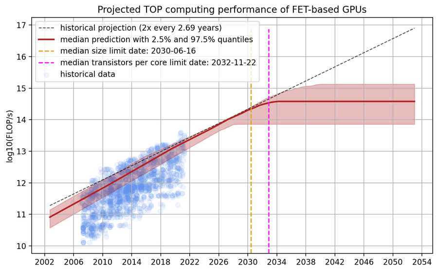

# Quai-Qi Conversion Controller #

<pre>
  QIP: 11
  Layer: Protocol
  Title: Quai-Qi Conversion Controller
  Author: kiltsonfire
  Comments-Summary: No comments yet.
  Comments-URI: https://github.com/quainetwork/qips/wiki/Comments:QIP-0011
  Status: Draft
  Type: Standards Track
  Created: 2024-02-13
  License: BSD-2-Clause
</pre>

## Abstract ##

This QIP defines the reward functions for Qi and Quai as well as the 
controller which allows protocol conversions between Qi and Quai.

## Motivation ##

Conversions between Quai  and Qi are needed to allow dynamic rebalancing of
total supply of Qi as the aggregate market demand for Qi changes. The minting
of Quai and Qi only by the miners with block reward production does not have
sufficient dynamic response when the supply of Quai and Qi matures. To allow
a frequency response which will be able to more closely match the market, 
an endongenous conversion ratio is introduced. This conversion ratio can then
be used to allow calculations of the relative blockrewards for a block, Quai or
Qi, as well as speculators to conduct conversions between Quai and Qi. When
a conversion from Qi to Quai takes place, Qi will be burned and Quai will be
minted. This will allow for the supply of Qi to adjust with demand and more
closely realize a market value which reflects the cost of production, i.e. 
the cost of generating the hash needed to mint 1 Qi.

## Specification ##

There will need to be two controllers, one that operates in a single zone,
and one that operates on the prime block.  The prime block controller will
establish the exchange rate for conversions between Quai and Qi. This controller
will be referred to as the exchange rate controller.  The controller
in each of the zones will establish the exchange rate for mined block rewards.
This controller will be referred to as the block reward controller.
This will ensure that even if there is an inbalance in the hashrate between
zones, that all zones will be encourage to operate at a stable control point
where both quai and qi are being taken as block rewards.

### Overview ###

Before getting into the specifics of the controller design, the economic 
justification for the controller needs to be established.  It is assumed
that if the supply matches the demand for both quai and qi, miners and
speculators will be agnostic to which token they are rewarded/hold.  This
means that when there are equivalent value conversion flows from quai to qi
and qi to quai for conversions, the exchange rate controller has found the
market equilibrium exchange rate for Qi and Quai. When the miners are choosing
rewards in Qu and rewards in quai for mining a block at an equivalent frequency,
ie 50% of the time, the block reward controller has established the local 
market equilibrium reward rate. 

This design anticipates that the supply of both Quai and Qi may expand and
contract overtime as the relative market utility function of the pair changes
with time. One example of a change in preference could be related to a change
in the future expected value (FEV) of Quai. Specifically, if the majority
of the market had a positive FEV for Quai which subsequently becomes a 
negative FEV, the demand for Qi would likely increase.  The increased demand
stemming from the relative stability of Qi over Quai in the hypothetical 
market enviroment. This would mean that for Qi to maintain its tie to the
price of production, in equilibrium, the supply of Qi would need to increase
to satiate the new demand. Conversly, if the FEV of Quai went from being
negative to positive, then the demand for Qi would drop.  Again to maintain
parity with the cost of production, speculators would leverage the conversion
mechanism to purchase Qi, likely at sub parity, convert it to Quai to realize
a profit equivalent to the difference they paid for Qi relative to the equilibrium
price.

In addition to the FEV example, there are a litiney of other factors external
to the system which could influence the relative utility functions overtime.This
could include changes in demand for fungability, smart contracts, single token
exchange listings/delistings, acceptance of tokens by new merchants, et cetera.
Therefore, the goal of the controller is to cause the endogenous exchange
rate offered by the system to converge to the current market equilibrium exchange
rate. This will provide an efficient mechanism to expand and contract token supplies with
changing preferences.

### Duration ###

Everytime an conversion transaction is made, the lockup period for getting the 
converted tokens will be 2048 prime blocks. This is roughly equivalent to 2 weeks.
The reason for creating friction in conversion is to not only to incentivize users
to hold Qi, rather than convert at point-of-use, but to also incentivize market
makers to anticipate changes in the relative utility functions with time. This will
cause market makers to dampen out volatility in the pair pricing. 

## Reward Function ##

### Qi Reward ###

The reward functions for Qi will take the form of:

$$ Qi(\epsilon,diff) = k_{qi}(\epsilon) * diff $$

Where the initial value of the coefficient $k_{qi}$ should be chosen to make the initial value of Qi
easily comparable to existing units of account. For example, a $k_{qi}$ value could
be chosen to make the initial value of Qi to be near parity with the dollar, Euro, or Pound.
Also, note here that $k_{qi}$ is a function of $\epsilon$ which is the relative projected change
in efficiency of FET based GPUs. This is done to prevent changes in efficiency of GPUs from causing
significant short term deflation in the purchasing power of Qi.  

### Quai Reward ###

The reward fuction for Quai will take the form of:

$$ Quai(k_{quai}(\bar{R}_{hash}),diff) = 2^{-k_{quai}(\bar{R}_{hash})}* log_2(diff)$$

The astutue reader will notice that a simple model has been introduced, namely raising $k_{quai}$
to the power of 2. This will allow a simple controller to maintain stability
with fixed controller gains over orders of magnitude changes in difficulty.

### Projected  Efficiency ###

The projected GPU efficiency is introduced to help Qi be more strictly reflective of the electricity
cost component in mining.  This will help Qi maintain a more stable purchasing power compared
to having a reward function that does not adjust with GPU efficiency. Again the primary goal
being to have a low enough volotility in the change in purchasing power to allow goods and
services to be easily denominatable in Qi. Thus, Qi could be used as a unit of account.

The projected GPU efficiency curve should be fitted to relect the median prediction from:

Marius Hobbhahn and Tamay Besiroglu (2022), ["Predicting GPU Performance"](https://epochai.org/blog/predicting-gpu-performance)

The curve proposed is as follows:


> Image 1: The projected performance of FET based GPUs

Extracted Data 
```
X | Y
2002.7,10.75
2014.1,12.04
2024.75,13.36
2028.9,13.87
2030.8,14.10
2032.6,14.23
2036.7,14.31
2051.4,14.31
```
The fit derived from the expected performance data is as follows:

$$
for \; x \; \left\{ \begin{array}{c}
< 2032 : -229.16 + 0.119779 x \\
>= 2032 : \qquad \qquad \quad 14.257
\end{array} \right\}
$$

Based on the launch date of quai this function will need to be adjusted to account
for both the start date as well as the conversion between block number and year.

## Controller Design

Both the exchange rate and block reward controller will take the form of a simple
proportional integral controller.

### Exchange Rate Controller ###

The exchange rate controller input will be the simple moving average of the 
aggregate hash equivalent demand, $\bar{R}_{hash}$ for Qi, $D_{qi}$, and Quai, $D_{quai}$ over a period of 100 prime blocks. The setpoint
of the controller will be to maintain equivalent aggregate demand for Qi and Quai. The hash equivalent value
needs to be updated with each step. The $\bar{R}_{hash}$ will be computed as follows:

$$\bar{R}_{hash} = \sum_{l=n-m}^{n} \frac{D_{quai,l} - D_{qi,l}}{D_{quai,l} + D_{qi,l}}$$

where $n$ is the block number, $m= 100$ is the depth over which the average is taken. This will create an output that ranges from -1 to 1. This will be the input on which the controller operates. The controller for computing $k_{quai,exchange}(\bar{R}_{hash})$ will take the following form:

$$k_{quai,exchange}(\bar{R}_{hash}) = k_{quai,exchange}(\bar{R}_{hash}) + k_{quai}(\bar{R}_{hash}) * (P * \bar{R}_{hash} + I * \sum_{l=n-m}^{n} \bar{R}_{hash})$$

The values for $P_{exchange}$ and $I_{exchange}$ should be chosen to create stable controllers over order of magnitude changes in difficulty.

The exchange rate controller needs to take into account the exchanges of the Qi and Quai in all contexts.  This is
simply done by only allowing the process of conversion (type 4) transactions only on prime coincident blocks.  The
delay imposed to be able to trade is acceptable as the conversion should be thought of something only done relatively
infrequently by market makers. Smaller participants will simple go to an exchange to convert Qi to Quai, while the
conversion mechanism will be used to expand and contract the supply of Qi overtime.

### Block Reward Controller ###

The block reward controller input will be the mined block ratio, $\bar{R}_{mined}$ computed by taking
the average of the miners reward choice in a single zone, $M_{choice,i,j}$, Qi = 0, Quai = 1, over a period of
100 zone blocks. Where i,j is the location of the zone blockchain. The setpoint of the controller will be to maintain an equal mined
demand for Qi and Quai, ie hashRatio = 0.5. The $\bar{R}_{mined}$ will be computed as follows:

$$\bar{R}_{mined} = \frac{\sum_{l=n-m}^n M_{choice,i,j,l}}{m}$$

where $n$ is the block number, $m = 50$ is the depth over which the average is taken. This will create an output which ranges from 0 to 1. The controller for calulating the $k_{quai,reward}(\bar{R}_{mined})$ will take the form of:

$$k_{quai,mined}(\bar{R}_{mined}) = k_{quai,mined}(\bar{R}_{mined}) + k_{quai}(\bar{R}_{mined}) * (P * \bar{R}_{mined} + I * \sum_{l=n-m}^{n} \bar{R}_{mined})$$

The values for $P_{mined}$ and $I_{mined}$ should be chosen to create stable controllers over order of magnitude changes in difficulty.


